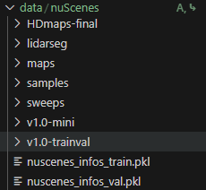

# CRN: Camera Radar Net for Accurate, Robust, Efficient 3D Perception


## Getting Started

### My Device Specifications
```
NVIDIA TITAN RTX
CUDA Driver Version: 12.2 (can be checked using `nvidia-smi` command)
```

### Installation
```shell
# clone repo
git clone https://github.com/parkie0517/CRN.git

cd ./hj_CRN

# setup conda environment
conda env create --file hj_CRN.yaml
conda activate hj_CRN

# install dependencies
pip install torch==1.9.1+cu111 torchvision==0.10.1+cu111 -f https://download.pytorch.org/whl/torch_stable.html
pip install pytorch-lightning==1.6.0
# if pl keeps on downgrading torch version, then install torch and pl simultaneously (use the code below)
# pip install torch==1.9.1+cu111 torchvision==0.10.1+cu111 -f https://download.pytorch.org/whl/torch_stable.html pytorch-lightning==1.6.0


mim install mmcv==1.6.0
mim install mmsegmentation==0.28.0
mim install mmdet==2.25.2

cd mmdetection3d
pip install -v -e .
cd ..

python setup.py develop  # GPU required
# if you encounter an error while running the code above, install the cuda runtime API
# conda install nvidia/label/cuda-12.2.0::cuda-toolkit # according to your CUDA driver version (which can be checked by `nvidia-smi` command)
# export CUDA_HOME=$CONDA_PREFIX
# pip install --no-build-isolation -e .
```

### Data preparation
**Step 0.** Download [nuScenes dataset](https://www.nuscenes.org/nuscenes#download).
origianlly looked like this  
  

**Step 1.** Symlink the dataset folder to `./data/nuScenes/`.
```
ln -s [nuscenes root] ./data/
# for example
# ln -s ~/ssd1tb/nuScenes ./data/
```

**Step 2.** Create annotation file. 
This will generate `nuscenes_infos_{train,val}.pkl`.
```
python scripts/gen_info.py
```

**Step 3.** Generate ground truth depth.  
*Note: this process requires LiDAR keyframes.*  
Takes about 15 seconds.  
```
python scripts/gen_depth_gt.py
```

**Step 4.** Generate radar point cloud in perspective view. 
You can download pre-generated radar point cloud [here](https://kaistackr-my.sharepoint.com/:u:/g/personal/youngseok_kim_kaist_ac_kr/EcEoswDVWu9GpGV5NSwGme4BvIjOm-sGusZdCQRyMdVUtw?e=OpZoQ4).  
*Note: this process requires radar blobs (in addition to keyframe) to utilize sweeps.*  
```
python scripts/gen_radar_bev.py  # accumulate sweeps and transform to LiDAR coords
python scripts/gen_radar_pv.py  # transform to camera coords
```

The folder structure will be as follows:
```
CRN
├── data
│   ├── nuScenes
│   │   ├── nuscenes_infos_train.pkl
│   │   ├── nuscenes_infos_val.pkl
│   │   ├── maps
│   │   ├── samples
│   │   ├── sweeps
|   |   ├── depth_gt
|   |   ├── radar_bev_filter  # temporary folder, safe to delete
|   |   ├── radar_pv_filter
|   |   ├── v1.0-trainval
```

### Training and Evaluation

-b: batch size per device  
-e: evaluation mode (validation set)  
--gpus: number of gpus you want to use (gpus >= 1)  


**Training**
```
python [EXP_PATH] --amp_backend native -b 4 --gpus 4
# for example
# CUDA_VISIBLE_DEVICES=1 python ./exps/det/CRN_r18_256x704_128x128_4key.py --amp_backend native -b 1 --gpus 1
```

**Evaluation**  
*Note: use `-b 1 --gpus 1` to measure inference time.*
```
python [EXP_PATH] --ckpt_path [CKPT_PATH] -e -b 4 --gpus 4
# for example
# CUDA_VISIBLE_DEVICES=1 python ./exps/det/CRN_r18_256x704_128x128_4key.py --ckpt_path /home/vilab/ssd1tb/hj_CRN/exps/det/CRN_r18_256x704_128x128_4key.pth -e -b 1 --gpus 1
# or
# CUDA_VISIBLE_DEVICES=1 python ./exps/det/CRN_r50_256x704_128x128_4key.py --ckpt_path /home/vilab/ssd1tb/hj_CRN/exps/det/CRN_r50_256x704_128x128_4key.pth -e -b 1 --gpus 1
```

## Model Zoo
All models use 4 keyframes and are trained without CBGS.  
All latency numbers are measured with batch size 1, GPU warm-up, and FP16 precision.

|  Method  | Backbone | NDS  | mAP  | FPS  | Params | Config                                                  | Checkpoint                                                                                                  |
|:--------:|:--------:|:----:|:----:|:----:|:------:|:-------------------------------------------------------:|:-----------------------------------------------------------------------------------------------------------:|
| BEVDepth |   R50    | 47.1 | 36.7 | 29.7 | 77.6 M | [config](exps/det/BEVDepth_r50_256x704_128x128_4key.py) | [model](https://github.com/youngskkim/CRN/releases/download/v1.0/BEVDepth_r50_256x704_128x128_4key.pth) |
|   CRN    |   R18    | 54.2 | 44.9 | 29.4 | 37.2 M | [config](exps/det/CRN_r18_256x704_128x128_4key.py)      | [model](https://github.com/youngskkim/CRN/releases/download/v1.0/CRN_r18_256x704_128x128_4key.pth)      |
|   CRN    |   R50    | 56.2 | 47.3 | 22.7 | 61.4 M | [config](exps/det/CRN_r50_256x704_128x128_4key.py)      | [model](https://github.com/youngskkim/CRN/releases/download/v1.0/CRN_r50_256x704_128x128_4key.pth)      |


## Features
- [ ] BEV segmentation checkpoints 
- [ ] BEV segmentation code 
- [x] 3D detection checkpoints 
- [x] 3D detection code 
- [x] Code release 
